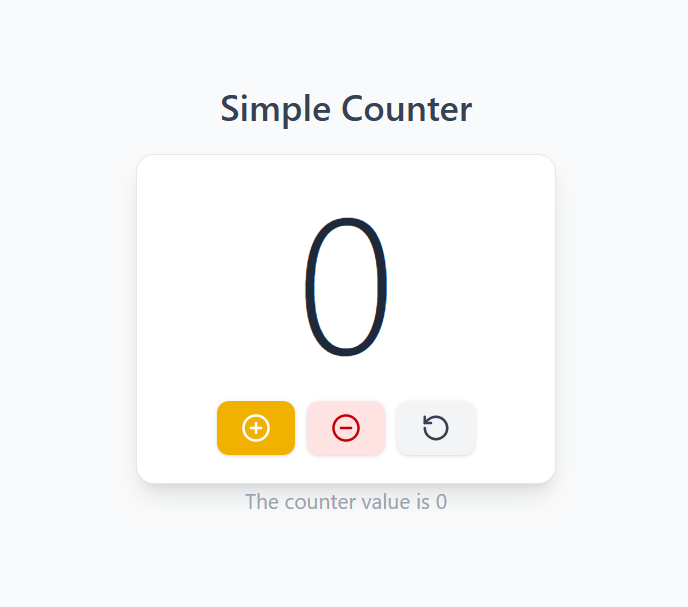

# 🔢 Counter App

A clean and responsive **Counter Application** built with **React** and **Vite**, styled with **Tailwind CSS** and using **Lucide React** icons. This app allows users to increment, decrement, and reset a counter — demonstrating core React concepts like `useState`, component structure, and event handling.


---

## ✨ Features

- ➕ **Increment** — Increase the counter by 1
- ➖ **Decrement** — Decrease the counter by 1
- 🔄 **Reset** — Reset the counter back to 0
- ⚡ Fast and responsive UI powered by Vite's HMR (Hot Module Replacement)
- 🎨 Clean and minimal design using **Tailwind CSS**
- 🔷 Beautiful icons powered by **Lucide React**

---

## 🛠️ Tech Stack

| Technology | Purpose |
|------------|---------|
| React 18 | UI Library |
| Vite | Build Tool & Dev Server |
| JavaScript (ES6+) | App Logic |
| Tailwind CSS | Utility-First Styling |
| Lucide React | Icon Library |
| ESLint | Code Linting |

---

## 📁 Project Structure

```
Counter-App/
├── public/
│   └── vite.svg
├── src/
│   ├── assets/
│   ├── App.jsx          # Main App Component
│   ├── App.css          # App Styles
│   ├── main.jsx         # Entry Point
│   └── index.css        # Global Styles (Tailwind directives)
├── index.html
├── package.json
├── vite.config.js
├── eslint.config.js
└── README.md
```

---

## 🚀 Getting Started

### Prerequisites

Make sure you have the following installed on your machine:

- [Node.js](https://nodejs.org/) (v16 or higher)
- [npm](https://www.npmjs.com/) or [yarn](https://yarnpkg.com/)

### Installation

1. **Clone the repository**

```bash
git clone https://github.com/UsamaBashir786/Counter-App.git
```

2. **Navigate to the project directory**

```bash
cd Counter-App
```

3. **Install dependencies**

```bash
npm install
```

4. **Install Tailwind CSS with Vite plugin**

```bash
npm install tailwindcss @tailwindcss/vite
```

5. **Install Lucide React icons**

```bash
npm install lucide-react
```

6. **Start the development server**

```bash
npm run dev
```

7. **Open your browser** and visit:

```
http://localhost:5173
```

---

## 📦 Available Scripts

| Command | Description |
|---------|-------------|
| `npm run dev` | Start the development server |
| `npm run build` | Build the app for production |
| `npm run preview` | Preview the production build |
| `npm run lint` | Run ESLint to check for code issues |

---

## 📸 Preview

> A simple counter interface with **Increment**, **Decrement**, and **Reset** buttons, displaying the current count value in real time.



---

## 🧠 Concepts Practiced

- React functional components
- `useState` hook for state management
- Event handling in React
- Props and component reusability
- Vite project setup and configuration
- Utility-first styling with **Tailwind CSS**
- Icon integration using **Lucide React**

---

## 🤝 Contributing

Contributions are welcome! If you'd like to improve this project:

1. Fork the repository
2. Create a new branch (`git checkout -b feature/your-feature`)
3. Commit your changes (`git commit -m 'Add some feature'`)
4. Push to the branch (`git push origin feature/your-feature`)
5. Open a Pull Request

---

## 👨‍💻 Author

**Usama Bashir**

- GitHub: [@UsamaBashir786](https://github.com/UsamaBashir786)

---

## 📄 License

This project is open source and available under the [MIT License](LICENSE).

---

> ⭐ If you found this project helpful, please give it a star on GitHub!